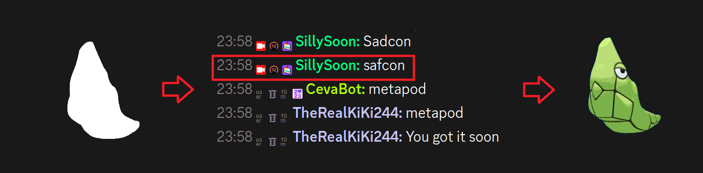

# "Who's That Pokémon" Mini-Game

Welcome to my "Who's That Pokémon" Twitch widget project. This project contains a simple browser source for the streaming application of your choice, to allow you to play "Who's that Pokémon" with your community on twitch via the text chat, using the points system implemented by Streamelements for the rewards.



### Installation:
Follow these steps to install this widget for your stream:

1. Download the [Zip file](https://codeload.github.com/SillySoon/who-is-that-pokemon/zip/refs/heads/main) of this project.
2. Extract the files to a folder of your choice (you will need the path for your streaming software).
3. Configure the settings in the `script.js` file located in the `src` folder.
4. In your streaming software, create a Browser source, check the "Local File" box, and navigate to the project. Select the `index.html` file from the `src` folder.
5. Set the Width and Height to 500px.
6. Enjoy!

### Configuration:
You can find the configuration settings in the `script.js` file.

```js
// Settings
let autoRestart = 1;
let autoStart = true;

let autoGiveUp = true;
let autoGiveUpTime = 300; // Seconds

// Pokédex entries: Min 1, Max 898 supported.
let min = 1;
let max = 151;

let channel = "helpingspoon"; // Add your channel here.
let botuser = ""; // Add your Bot Username here.
let token = ""; // Add your Bot Token here, from http://twitchapps.com/tmi/

// Points for StreamElements (!addpoints [user] [amount]) - Set to 0 to disable.
let pointReward = 200;
```